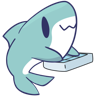

# All hail Shonky!

Shonky (they/them) is the best shonk mascot for [Blåhaj Lemmy](https://lemmy.blahaj.zone) and [Blåhaj Zone](https://blahaj.zone).

Shonky enjoys a good time, swimming around, swinging on ceiling fans, snuggling up in bed and just generally banging away on their keyboard at Blåhaj Lemmy.

Their likeness is available for promotional work per the terms of the [design copyright and license](#design-copyright-and-license) below.

## Design copyright and license

The logo was designed under commission for Blåhaj Lemmy by and is copyright [Heatherhorns](https://heatherhorns.com), used under license by the Blåhaj zone team.

The logo is our trademark and may be used by you under a good-faith license when referring to the Blåhaj sites, but not in a way that is malicious or suggests you are endorsed by or a product of either Heatherhorns or Blåhaj zone.

If the logo is misused or not used in a good-faith way, your license is revoked.

Attribution may be given by linking back to this repository or one of the main Blåhaj sites, but is generally not required as long as it's clear you're referring to the Blåhaj site.

## Style

The font used in the Blåhaj Lemmy logo is [Acme](https://fonts.google.com/specimen/Acme) from Google fonts.

## Files

Enclosed herein you'll find various pregenerated assets in the `assets` folder, with the source file in `source/Shonky.sketch`. It's a sketch file and should work in sketch, but is crafted in [Lunacy](https://icons8.com/lunacy).
